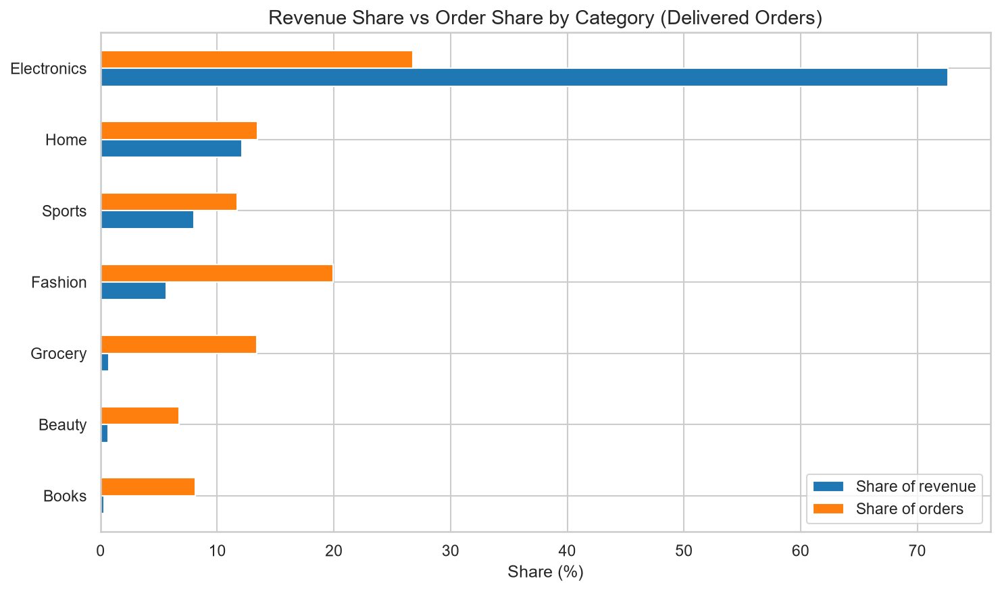
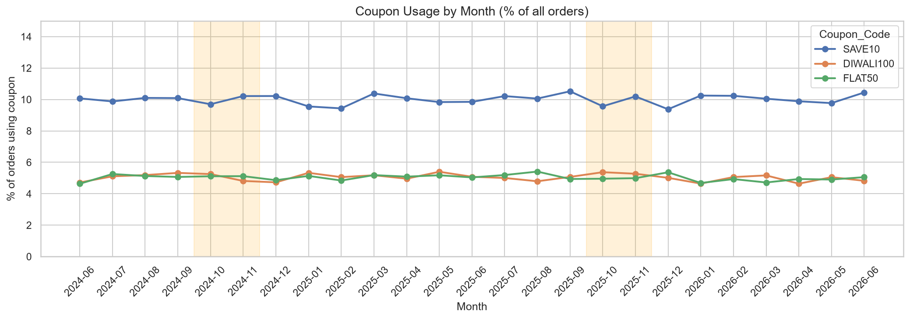
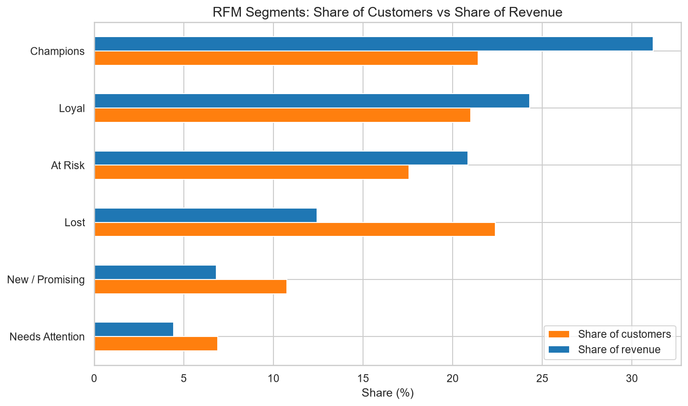
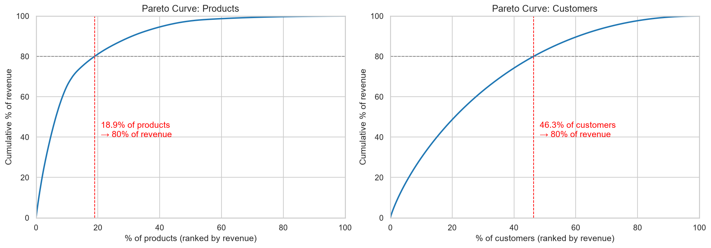
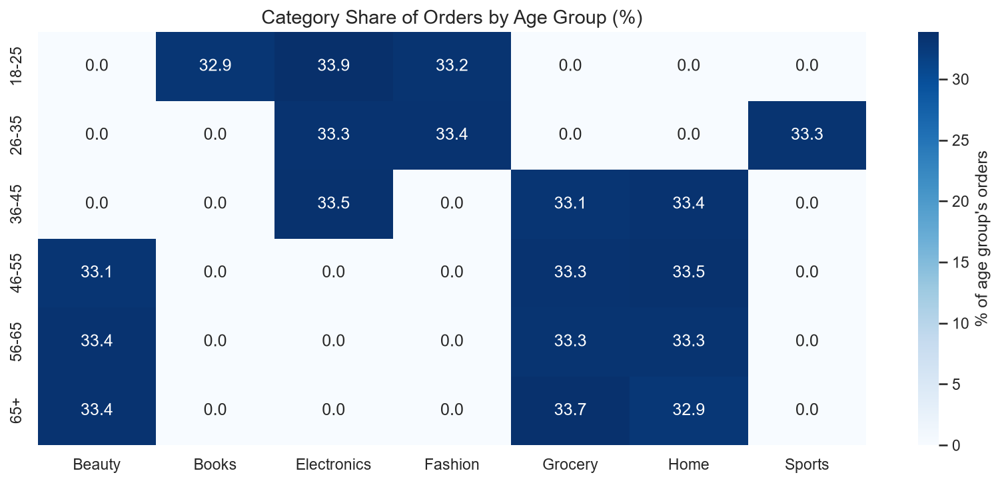

# 🛒 Indian E-Commerce Sales Analysis

End-to-end analysis of **250,000 orders** from a multi-table Indian e-commerce dataset using Python: data validation, cleaning, exploratory analysis, statistical testing, Pareto analysis and RFM customer segmentation, ending in costed business recommendations.

**Tools:** Python · Pandas · NumPy · Matplotlib · Seaborn · SciPy · Jupyter

---

## 📌 Business Problem

An Indian e-commerce company wants to understand its sales performance and find ways to grow revenue and reduce losses. The analysis answers:

1. How does revenue change over time? Is there a festive (Diwali) effect?
2. Which categories, brands and products drive revenue?
3. Which states and cities perform best, and why?
4. How do customer tiers, ages and genders differ?
5. Are Cash-on-Delivery orders riskier than prepaid orders?
6. How much do coupons cost, and are they well designed?
7. Does delivery speed affect customer ratings?
8. Which customers should be rewarded, retained or won back?

---

## 📊 Headline Numbers

| Metric | Value |
|---|---|
| GMV (all orders) | ₹593.07 crore |
| Net Revenue (delivered orders) | ₹474.16 crore |
| Lost to cancellations & returns | ₹60.25 crore (10.2% of GMV) |
| Median order value | ₹8,332 |
| Customers / Products | ~40,000 / 2,000 |

---

## 🔍 Key Findings

**1. Revenue depends heavily on Electronics.** Electronics generates ~72% of revenue from only ~27% of orders, and just 379 products (18.9%) generate 80% of all revenue.



**2. One coupon causes 97% of discount cost.** Coupons cost ₹5.01 crore in total. SAVE10 has no maximum discount (up to ₹38,279 on a single order), while flat coupons have no minimum order value, creating loss-making orders. The "DIWALI100" coupon runs all year, not just during Diwali.



**3. A hidden free-shipping rule.** Every order below ~₹500 pays shipping, and every order above ships free. This rule was found from the data alone. Books (30%) and Grocery (26%) orders fall below it most often.

**4. High-value customers are slipping away.** RFM segmentation identified 6,975 "At Risk" customers who spent as much as Loyal customers (₹1.42 lakh each) but haven't ordered in ~8 months, representing ~₹99 crore of historic revenue.



**5. A few products, many customers.** 18.9% of products drive 80% of revenue, but it takes 46.3% of customers to reach the same share.



---

## 💡 Recommendations

| # | Recommendation | Estimated impact |
|---|---|---|
| 1 | Cap SAVE10 (e.g. "10% off up to ₹2,000") | Saves up to ₹2.82 crore/2 yrs, affects 33% of SAVE10 users |
| 2 | Win-back campaign for "At Risk" customers | Protects a segment worth ~₹99 crore historically |
| 3 | Protect stock of the 379 "hero" products | Safeguards 80% of revenue |
| 4 | Minimum order value on flat coupons; limit DIWALI100 to festive season | Stops loss-making orders |
| 5 | "Add ₹X for free shipping" bundles in Books, Grocery, Beauty | Raises low basket values above ₹500 |
| 6 | Expand into new cities | Each city contributes a similar ~₹12 crore |

*Savings are upper-bound estimates; some customers may not buy without the full discount.*

---

## ⚠️ Findings That Looked Real But Weren't

A key part of this project was checking whether patterns were real before reporting them:

- **February "sales dip"** → caused by February having 28 days. Revenue *per day* is stable all year.
- **Uttar Pradesh as the "top market"** → states with more cities in the data rank higher. Revenue *per city* is nearly identical everywhere (₹11.9–12.7 crore).
- **Older customers spend less** → each age group buys from exactly three categories (a rule built into the simulated data), so this isn't real behaviour.



**Hypotheses tested and not supported:** COD orders are not riskier (chi-square p = 0.96); no Diwali revenue uplift; delivery speed has no effect on ratings (correlation −0.002).

---

## 🛠️ Methods

- **Data validation:** verified money formulas across all 250,000 rows, key uniqueness and referential integrity between tables, and business-logic checks (no deliveries before orders, no orders before registration)
- **Cleaning:** fixed issues without deleting any orders: date conversion, meaningful handling of missing values, capping of 5 negative totals with a flag column, name standardisation
- **Feature engineering:** 11 new columns (year-month, weekday, order hour, delivery days, status groups, coupon and shipping flags)
- **Analysis:** normalisation (per day, per city), chi-square test, correlation, Pareto (80/20) analysis, RFM segmentation

---

## 📁 Project Structure

```
indian-ecommerce-sales-analysis/
├── notebook/
│   ├── 01_data_understanding.ipynb    # Data quality checks & hypotheses
│   ├── 02_data_cleaning.ipynb         # Cleaning, feature engineering, table joins
│   └── 03_analysis_and_insights.ipynb # Analysis, findings & recommendations
├── images/                            # Saved charts
├── data/                              # Not uploaded (see below)
├── requirements.txt
└── README.md
```

---

## ▶️ How to Run

1. Download the dataset from Kaggle: [Indian E-Commerce Sales Analytics Dataset](https://www.kaggle.com/datasets/jatinkhandelwal112/indian-e-commerce-sales-analytics-dataset)
2. Place `sales.csv`, `customers.csv` and `products.csv` in `data/raw/`
3. Install requirements: `pip install -r requirements.txt`
4. Run the notebooks in order (01 → 02 → 03)

---

## 📝 Limitations

The dataset is **simulated**. Several patterns confirm this: order statuses are each exactly ~5% and spread evenly over time, ratings are exactly 10%/40%/50% (3/4/5 stars) with no low ratings, delivery times are perfectly uniform, reviews use only 9 template phrases, and each age group buys from exactly three categories. Findings therefore demonstrate **analytical methods** rather than real market behaviour. The full list of 12 limitations is at the end of Notebook 03.

---

## 👤 Author

**Vinoth**. Aspiring Data Analyst | MBA (Business Data Analytics), University of Madras

[linkedin.com/in/vinothmadhavarao] · [vinothmadhavarao@gmail.com] · [github.com/vinothmadhavarao]
